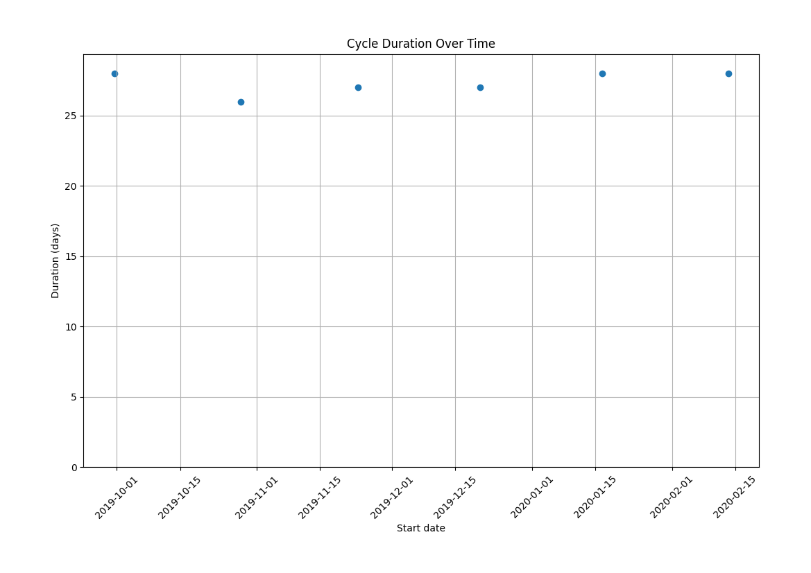

## Cycle Plotter

This command-line tool reads data from an Apple Health or Withings Healthmate export, and creates a plot of cycle durations.


On the x-axis, we have the date at the beginning of a cycle.

On the y-axis, we have the duration of the cycle. The duration of a cycle is the number of days between its start, and the start of the next cycle.


## Usage

Run the program with the `--help` argument to see the full usage.

```
% python -m cycleplotter.main --help
usage: main.py [-h] --input-file INPUT_FILE --output-file OUTPUT_FILE --source {apple,withings}

options:
  -h, --help            show this help message and exit
  --input-file INPUT_FILE
                        path to export.xml file exported from Apple Health
  --output-file OUTPUT_FILE
                        path to image file to export
  --source {apple,withings}
```

The program has been tested exporting to png and pdf. But other formats are probably supported. The program uses matplotlib to output the image. The supported file formats may be in the matplotlib [documentation](https://matplotlib.org/stable/api/backend_bases_api.html#matplotlib.backend_bases.FigureCanvasBase.filetypes).

Examples:


Export a png of data from Apple Health, using long arguments:
```shell
python -m cycleplotter.main --input-file ~/Downloads/export.zip  --output-file /tmp/cyclegraph.png --source apple
```

Export a pdf of data from Withings Health Mate, using short arguments:
```shell
python -m cycleplotter.main -i ~/Downloads/data_ABC_1717249954.zip  -o /tmp/cyclegraph.pdf -s withings
```
