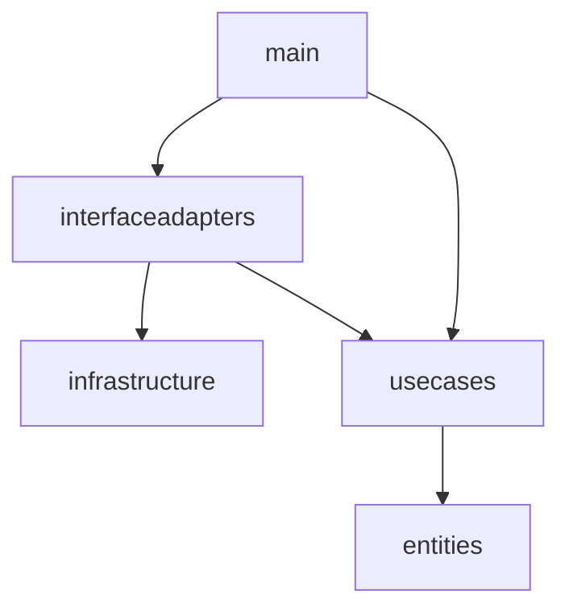
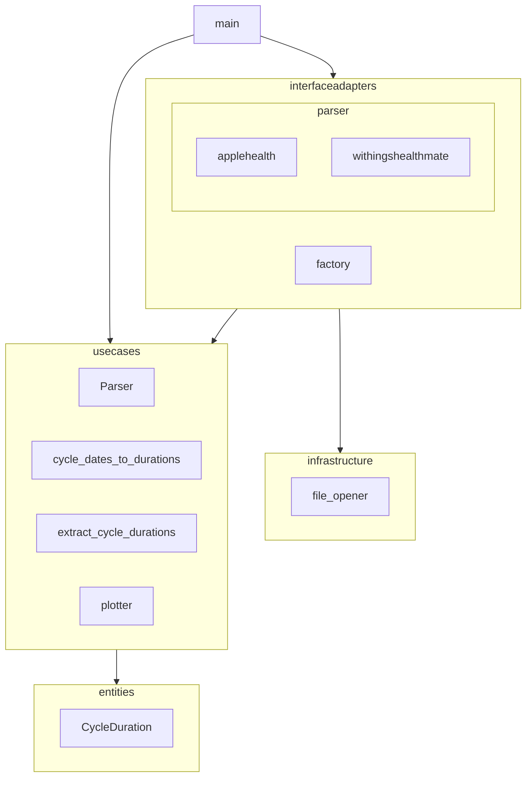
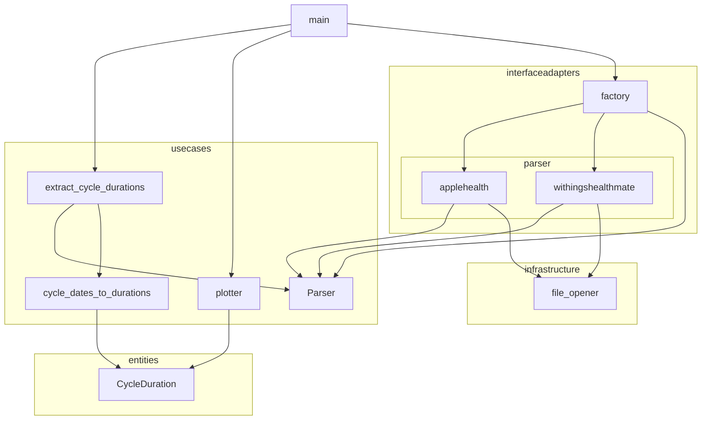

# Architecture

## Packages, with package dependencies

```mermaid
flowchart TD
    entities
    infrastructure
    interfaceadapters
    usecases
    main

    main --> usecases
    main --> interfaceadapters
    interfaceadapters --> infrastructure
    interfaceadapters --> usecases
    usecases --> entities
```

## Packages and modules, with package dependencies

```mermaid
flowchart TD
    subgraph entities
        CycleDuration
    end
    subgraph infrastructure
        file_opener
    end
    subgraph interfaceadapters
        subgraph parser
            applehealth
            withingshealthmate
        end
        factory
    end
    subgraph usecases
        Parser
        cycle_dates_to_durations
        extract_cycle_durations
        plotter
    end
    main

    main --> usecases
    main --> interfaceadapters
    interfaceadapters --> infrastructure
    interfaceadapters --> usecases
    usecases --> entities
```

## Packages and modules, with module dependencies

```mermaid
flowchart TD
    subgraph entities
        CycleDuration
    end
    subgraph infrastructure
        file_opener
    end
    subgraph interfaceadapters
        subgraph parser
            applehealth
            withingshealthmate
        end
        factory
    end
    subgraph usecases
        Parser
        cycle_dates_to_durations
        extract_cycle_durations
        plotter
    end
    main

    main --> extract_cycle_durations
    main --> plotter
    main --> factory

    factory --> applehealth
    factory --> withingshealthmate
    factory --> Parser
    applehealth --> Parser
    applehealth --> file_opener
    withingshealthmate --> Parser
    withingshealthmate --> file_opener

    cycle_dates_to_durations --> CycleDuration
    extract_cycle_durations --> Parser
    extract_cycle_durations --> cycle_dates_to_durations

    plotter --> CycleDuration
```
